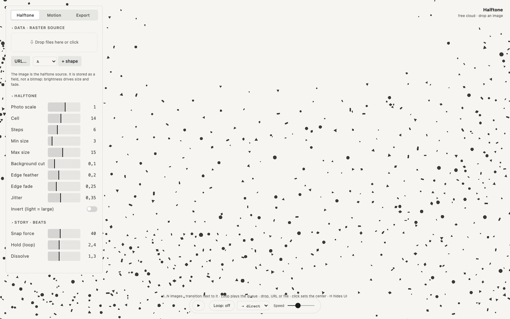

  

<h1 align="center">Halftone Cloud</h1>

  Images rebuilt as a halftone of flying shapes 
  one HTML file · runs in the browser · no install · free and open source

  <a href="https://robvagin.github.io/halftone-cloud/"><b>Open Halftone Cloud</b></a> ·
  <a href="#run-it">Run it</a> ·
  <a href="#more-tools">More tools</a>

---

Drop an image and it turns into a cloud of small shapes: brightness becomes size. Drop several and they become a story, one picture flowing into the next.

## What it does

- **Any image:** drop a file, paste a URL or start from a built-in shape
- **Halftone:** cell, steps, minimum and maximum size, background cut, edge feather and fade
- **Story beats:** several images in a row with direct, scatter, fall or cycle transitions; Loop plays the queue
- **Swarm** motion between beats, with collisions so shapes never overlap
- **Export:** PNG and a JSON config

## Run it

Open [robvagin.github.io/halftone-cloud](https://robvagin.github.io/halftone-cloud/), or download `index.html` and open it from your disk. It is the whole tool: no build step, no dependencies, no network. Press **H** to hide the panel.

## Made by a designer

I'm a designer. I build small tools like this for my own work, with AI agents: I make the decisions, Claude Code writes the code. The panels follow one grammar across the whole set.

Take it if you want it.

## More tools

- [Particle Dance](https://github.com/robvagin/particle-dance) · particles that dance along patterns and 3D forms
- [Murmur](https://github.com/robvagin/murmur-vj) · a VJ visualizer: circles, triangles and squares that move to your music
- [Orbital](https://github.com/robvagin/orbital) · data as orbits, axes or a bending mesh
- [Metaballs](https://github.com/robvagin/metaballs) · soft masses that merge, split and leave holes
- [Logomachine](https://github.com/robvagin/logomachine) · seeded generative marks: one seed, one pattern, always
- [Motion Primer](https://github.com/robvagin/motion-primer) · bodies with behaviors: swarm, pack, magnet, orbit, fall, scatter
- [Particles 3D](https://github.com/robvagin/particles-3d) · a WebGL2 cloud of up to 300,000 particles
- [Orb Atom](https://github.com/robvagin/orb-atom) · glass orbs that think: lenses with soft bodies drifting inside
- [Ellipse Sphere](https://github.com/robvagin/ellipse-sphere) · a sphere built from stacked discs that fan open and assemble
- [Thinking Sphere](https://github.com/robvagin/thinking-sphere) · a glass sphere with soft shapes drifting inside
- [SphereGen](https://github.com/robvagin/spheregen) · a glass sphere that bends whatever is behind it: generative scenes, photos, video
- [Line Engine](https://github.com/robvagin/line-engine) · engraved line patterns: superformulas, rosettes, waves and Lissajous, in motion
- [XYZ Cube](https://github.com/robvagin/xyz-cube) · your data as points in a 3D cube on axes you name
- [Hexbin](https://github.com/robvagin/hexbin) · a point cloud counted into 3D hexagon towers
- [Chart 3D](https://github.com/robvagin/chart-3d) · pie, bars, polar and area charts in 3D, with an entrance
- [Sunburst](https://github.com/robvagin/sunburst) · a hierarchy as a 3D sunburst with height
- [Voronoi](https://github.com/robvagin/voronoi) · points that share space as cells, inside any shape
- [Image Shuffler](https://github.com/robvagin/image-shuffler) · your screens flying in 3D, ready to record as a video
- [Motion Pad](https://github.com/robvagin/motion-pad) · one pad for the character of motion
- [Pack Label](https://github.com/robvagin/pack-label) · one label per coffee lot, checked and ready for print

## License

[MIT](LICENSE) © 2026 Robert Vagin
